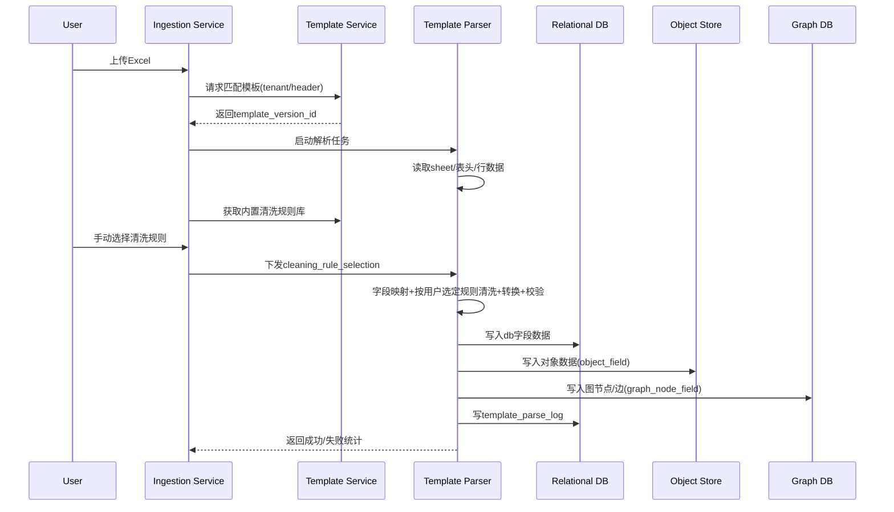

# Excel 数据模板系统设计

> 目标：支持用户上传 Excel 数据，并完成 **Excel字段 → 数据库字段 → 对象字段 → 图节点字段** 的多级映射；支持一个 Excel 包含多个对象、字段映射、字段清洗、字段转换。

---

## 1. 模板结构设计

## 1.1 设计目标

模板系统需要同时描述：

1. Excel 文件结构（Sheet、表头、起始行）
2. 字段映射规则（4级映射链路）
3. 字段清洗规则（标准化、去噪）
4. 字段转换规则（派生、拼接、类型转换）
5. 多对象拆分规则（一个 Excel 多实体）
6. 图谱构建规则（节点字段、边字段）

---

## 1.2 核心概念

- **Template（模板）**：描述一个 Excel 类型数据如何被解析。
- **SheetMapping（工作表映射）**：一个 sheet 对应一组对象抽取规则。
- **ObjectModel（对象模型）**：从 Excel 行数据中抽取出的业务对象（如 PERSON/ORG/DEVICE）。
- **FieldRule（字段规则）**：字段映射 + 清洗 + 转换规则的最小单元。
- **CleaningRuleCatalog（清洗规则库）**：平台内置、可审计、可版本化的清洗规则集合。
- **CleaningSelection（清洗选择集）**：每次执行清洗时由用户手动选择的规则组合。

### 清洗规则使用原则（本次新增）

- 清洗规则**不再内嵌为模板固定逻辑**，而是由平台统一维护“内置规则库”。
- 用户在每次发起导入/清洗任务时，必须从内置规则库中**手动选择**本次要启用的规则。
- 模板仅定义“字段可用规则范围（白名单）”与默认建议，不直接强制执行。

---

## 1.3 4级字段映射链路

每个 Excel 字段都应支持以下链路：

`excel_field -> db_field -> object_field -> graph_node_field`

示例：

- `身份证号 -> person_id_no -> Person.idNo -> PersonNode.id_no`
- `手机号 -> phone_no -> Contact.phone -> PhoneNode.number`

---

## 1.4 模板 JSON 结构（完整示例）

```json
{
  "templateCode": "tpl_case_person_org_v1",
  "templateName": "案件-人员组织综合模板",
  "description": "适配人员、组织、账户混合Excel",
  "sourceType": "EXCEL",
  "excelConfig": {
    "headerRowIndex": 1,
    "dataStartRowIndex": 2,
    "dateSystem": "1900",
    "allowMergedCell": false,
    "sheets": [
      {
        "sheetName": "基础数据",
        "required": true,
        "objectBindings": [
          "PERSON",
          "ORG",
          "ACCOUNT"
        ]
      }
    ]
  },
  "objects": [
    {
      "objectType": "PERSON",
      "objectKeyExpr": "concat(id_no,'#',name)",
      "objectIdStrategy": "HASH_SHA256",
      "enableDedup": true,
      "fieldRules": [
        {
          "excelField": "姓名",
          "excelAliases": ["人员姓名", "name"],
          "dbField": "person_name",
          "objectField": "Person.name",
          "graphNodeField": "PersonNode.name",
          "dataType": "STRING",
          "required": true,
          "defaultValue": null,
          "allowedCleaningRuleCodes": [
            "CR_TRIM",
            "CR_REMOVE_SPECIAL_CHAR"
          ],
          "transformRules": [
            { "type": "TO_FULL_WIDTH", "enabled": false }
          ],
          "validateRules": [
            { "type": "LENGTH", "params": { "min": 1, "max": 128 } }
          ]
        },
        {
          "excelField": "身份证号",
          "excelAliases": ["证件号", "idNo"],
          "dbField": "person_id_no",
          "objectField": "Person.idNo",
          "graphNodeField": "PersonNode.id_no",
          "dataType": "STRING",
          "required": true,
          "allowedCleaningRuleCodes": [
            "CR_TRIM",
            "CR_UPPERCASE"
          ],
          "transformRules": [
            { "type": "MASK", "params": { "keepPrefix": 3, "keepSuffix": 2 }, "forStorage": "LOG_ONLY" }
          ],
          "validateRules": [
            { "type": "REGEX", "params": { "pattern": "^[0-9X]{18}$" } }
          ]
        },
        {
          "excelField": "出生日期",
          "dbField": "birth_date",
          "objectField": "Person.birthDate",
          "graphNodeField": "PersonNode.birth_date",
          "dataType": "DATE",
          "required": false,
          "transformRules": [
            {
              "type": "DATE_PARSE",
              "params": { "inputPatterns": ["yyyy/MM/dd", "yyyy-MM-dd"], "outputPattern": "yyyy-MM-dd" }
            }
          ]
        }
      ]
    },
    {
      "objectType": "ORG",
      "objectKeyExpr": "org_code",
      "objectIdStrategy": "RAW",
      "fieldRules": [
        {
          "excelField": "组织代码",
          "dbField": "org_code",
          "objectField": "Org.orgCode",
          "graphNodeField": "OrgNode.code",
          "dataType": "STRING",
          "required": true,
          "allowedCleaningRuleCodes": ["CR_TRIM"],
          "validateRules": [
            { "type": "REGEX", "params": { "pattern": "^[A-Z0-9-]{6,32}$" } }
          ]
        },
        {
          "excelField": "组织名称",
          "dbField": "org_name",
          "objectField": "Org.name",
          "graphNodeField": "OrgNode.name",
          "dataType": "STRING",
          "required": true,
          "allowedCleaningRuleCodes": ["CR_TRIM"]
        }
      ]
    }
  ],
  "graphRules": {
    "nodes": [
      {
        "nodeType": "PersonNode",
        "fromObjectType": "PERSON",
        "idExpr": "Person.idNo",
        "labelExpr": "Person.name",
        "propertyMappings": [
          { "from": "Person.name", "to": "name" },
          { "from": "Person.birthDate", "to": "birth_date" }
        ]
      },
      {
        "nodeType": "OrgNode",
        "fromObjectType": "ORG",
        "idExpr": "Org.orgCode",
        "labelExpr": "Org.name"
      }
    ],
    "edges": [
      {
        "edgeType": "WORKS_FOR",
        "fromNodeType": "PersonNode",
        "toNodeType": "OrgNode",
        "matchRule": {
          "type": "FIELD_EQUAL",
          "leftField": "PERSON.org_code",
          "rightField": "ORG.org_code"
        },
        "propertyMappings": [
          { "from": "PERSON.job_title", "to": "title" }
        ]
      }
    ]
  },
  "storageConfig": {
    "dbTable": "ods_case_person_org",
    "objectTable": "data_object",
    "graphSink": "janusgraph",
    "searchSink": "opensearch"
  },
  "cleaningSelectionPolicy": {
    "selectionMode": "MANUAL_EACH_RUN",
    "requireUserSelection": true,
    "minSelectedRules": 1
  },
  "qualityConfig": {
    "allowPartialSuccess": true,
    "maxErrorRate": 0.05,
    "errorAction": "REJECT_ROW"
  },
  "version": "1.0.0",
  "status": "PUBLISHED"
}
```

---

## 2. 模板存储结构（数据库结构）

> 建议 schema：`template_mgmt`。

## 2.1 主表：模板定义

### 表：`template_mgmt.template_def`

| 字段 | 类型 | 约束 | 说明 |
|---|---|---|---|
| id | bigint | PK | 模板ID |
| tenant_id | bigint | not null | 租户ID |
| template_code | varchar(64) | not null | 模板编码 |
| template_name | varchar(256) | not null | 模板名称 |
| source_type | varchar(32) | not null | EXCEL/CSV/JSON |
| status | varchar(32) | not null | DRAFT/PUBLISHED/DEPRECATED |
| latest_version | varchar(32) | not null | 最新版本号 |
| description | text | null | 描述 |
| created_by | bigint | not null | 创建人 |
| created_at | timestamptz | not null | 创建时间 |
| updated_at | timestamptz | not null | 更新时间 |
| is_deleted | boolean | default false | 软删 |

**唯一约束**
- `(tenant_id, template_code)`

**索引**
- `idx_tpl_def_tenant_status(tenant_id, status)`

---

## 2.2 版本表：模板快照

### 表：`template_mgmt.template_version`

| 字段 | 类型 | 约束 | 说明 |
|---|---|---|---|
| id | bigint | PK | 版本ID |
| tenant_id | bigint | not null | 租户ID |
| template_id | bigint | FK -> template_def.id | 模板ID |
| version_no | varchar(32) | not null | SemVer |
| excel_config_json | jsonb | not null | Excel解析配置 |
| objects_json | jsonb | not null | 对象映射规则 |
| graph_rules_json | jsonb | null | 图规则 |
| quality_config_json | jsonb | null | 质量规则 |
| checksum | varchar(128) | not null | 内容哈希 |
| change_log | text | null | 变更说明 |
| is_current | boolean | default false | 是否当前版本 |
| published_at | timestamptz | null | 发布时间 |
| created_by | bigint | not null | 创建人 |
| created_at | timestamptz | not null | 创建时间 |

**唯一约束**
- `(tenant_id, template_id, version_no)`

**索引**
- `idx_tpl_ver_current(tenant_id, template_id, is_current)`
- `idx_tpl_ver_checksum(checksum)`

---

## 2.3 子结构表：对象定义

### 表：`template_mgmt.template_object`

| 字段 | 类型 | 约束 | 说明 |
|---|---|---|---|
| id | bigint | PK | 主键 |
| tenant_id | bigint | not null | 租户ID |
| template_version_id | bigint | FK -> template_version.id | 模板版本 |
| object_type | varchar(64) | not null | PERSON/ORG/ACCOUNT |
| object_key_expr | text | not null | 对象唯一键表达式 |
| object_id_strategy | varchar(32) | not null | HASH_SHA256/RAW/UUID |
| enable_dedup | boolean | default true | 去重开关 |
| sort_order | int | default 1 | 执行顺序 |
| created_at | timestamptz | not null | 创建时间 |

**索引**
- `idx_tpl_obj_ver(template_version_id)`
- `idx_tpl_obj_type(tenant_id, object_type)`

---

## 2.4 子结构表：字段规则

### 表：`template_mgmt.template_field_rule`

| 字段 | 类型 | 约束 | 说明 |
|---|---|---|---|
| id | bigint | PK | 主键 |
| tenant_id | bigint | not null | 租户ID |
| template_version_id | bigint | FK | 模板版本 |
| object_id | bigint | FK -> template_object.id | 所属对象 |
| sheet_name | varchar(128) | not null | Sheet名 |
| excel_field | varchar(128) | not null | Excel字段 |
| excel_aliases_json | jsonb | null | 别名列表 |
| db_field | varchar(128) | not null | 数据库字段 |
| object_field | varchar(128) | not null | 对象字段 |
| graph_node_field | varchar(128) | null | 图节点字段 |
| data_type | varchar(32) | not null | STRING/INT/DATE/... |
| required_flag | boolean | default false | 是否必填 |
| default_value | text | null | 默认值 |
| allowed_cleaning_rule_codes_json | jsonb | null | 允许用户选择的清洗规则编码白名单 |
| transform_rules_json | jsonb | null | 转换规则 |
| validate_rules_json | jsonb | null | 校验规则 |
| sort_order | int | default 1 | 字段执行顺序 |
| created_at | timestamptz | not null | 创建时间 |

**唯一约束**
- `(tenant_id, template_version_id, object_id, sheet_name, excel_field)`

**说明**
- 字段规则仅定义可选清洗规则白名单，具体执行规则由用户每次任务在 `cleaning_rule_selection` 手动选择。

**索引**
- `idx_tpl_field_ver(template_version_id)`
- `idx_tpl_field_excel(tenant_id, excel_field)`
- `idx_tpl_field_db(tenant_id, db_field)`

---

## 2.5 子结构表：图规则

### 表：`template_mgmt.template_graph_rule`

| 字段 | 类型 | 约束 | 说明 |
|---|---|---|---|
| id | bigint | PK | 主键 |
| tenant_id | bigint | not null | 租户ID |
| template_version_id | bigint | FK | 模板版本 |
| rule_type | varchar(16) | not null | NODE/EDGE |
| graph_type | varchar(64) | not null | 节点/边类型 |
| from_object_type | varchar(64) | null | 来源对象类型 |
| to_object_type | varchar(64) | null | 目标对象类型(边) |
| id_expr | text | null | 节点ID表达式 |
| label_expr | text | null | 节点Label表达式 |
| match_rule_json | jsonb | null | 边匹配规则 |
| property_mappings_json | jsonb | null | 属性映射 |
| sort_order | int | default 1 | 顺序 |
| created_at | timestamptz | not null | 创建时间 |

**索引**
- `idx_tpl_graph_ver(template_version_id)`
- `idx_tpl_graph_type(tenant_id, rule_type, graph_type)`

---


## 2.6 子结构表：内置清洗规则库（新增）

### 表：`template_mgmt.cleaning_rule_catalog`

| 字段 | 类型 | 约束 | 说明 |
|---|---|---|---|
| id | bigint | PK | 主键 |
| rule_code | varchar(64) | UK, not null | 规则编码（如CR_TRIM） |
| rule_name | varchar(128) | not null | 规则名称 |
| rule_type | varchar(32) | not null | TRIM/REPLACE/REGEX/... |
| default_params_json | jsonb | null | 默认参数 |
| description | text | null | 规则说明 |
| enabled | boolean | default true | 是否启用 |
| built_in | boolean | default true | 是否内置 |
| version_no | varchar(32) | not null | 规则版本 |
| created_at | timestamptz | not null | 创建时间 |
| updated_at | timestamptz | not null | 更新时间 |

**索引**
- `idx_clean_rule_enabled(enabled)`
- `idx_clean_rule_type(rule_type)`

---

## 2.7 子结构表：任务清洗规则选择（新增）

### 表：`template_mgmt.cleaning_rule_selection`

| 字段 | 类型 | 约束 | 说明 |
|---|---|---|---|
| id | bigint | PK | 主键 |
| tenant_id | bigint | not null | 租户ID |
| import_job_id | bigint | not null | 导入任务ID |
| template_version_id | bigint | not null | 模板版本ID |
| object_type | varchar(64) | null | 对象类型（可为空表示全局） |
| field_rule_id | bigint | null | 字段规则ID（可为空表示对象级） |
| rule_code | varchar(64) | not null | 选中的内置规则编码 |
| rule_params_json | jsonb | null | 本次执行参数（覆盖默认） |
| selected_by | bigint | not null | 选择人 |
| selected_at | timestamptz | not null | 选择时间 |

**唯一约束**
- `(tenant_id, import_job_id, field_rule_id, rule_code)`

**索引**
- `idx_clean_sel_job(tenant_id, import_job_id)`
- `idx_clean_sel_rule(rule_code)`

---

## 2.8 运行日志表（模板解析）


### 表：`template_mgmt.template_parse_log`

| 字段 | 类型 | 约束 | 说明 |
|---|---|---|---|
| id | bigint | PK | 主键 |
| tenant_id | bigint | not null | 租户ID |
| template_version_id | bigint | FK | 模板版本 |
| import_job_id | bigint | not null | 导入任务ID |
| file_name | varchar(256) | not null | 文件名 |
| parse_status | varchar(32) | not null | RUNNING/SUCCESS/FAILED/PARTIAL |
| total_rows | bigint | default 0 | 总行数 |
| success_rows | bigint | default 0 | 成功行数 |
| failed_rows | bigint | default 0 | 失败行数 |
| error_summary | text | null | 错误摘要 |
| started_at | timestamptz | null | 开始时间 |
| ended_at | timestamptz | null | 结束时间 |
| created_at | timestamptz | not null | 创建时间 |

**索引**
- `idx_tpl_parse_job(tenant_id, import_job_id)`
- `idx_tpl_parse_status(tenant_id, parse_status)`

---

## 3. 模板解析流程

## 3.1 总体流程

```text
上传Excel -> 识别模板 -> 解析Sheet与表头 -> 字段映射
-> 字段清洗 -> 字段转换 -> 字段校验
-> 生成数据库记录 -> 生成对象数据 -> 生成图节点/边
-> 写入存储(ODS/Object/Graph/Search) -> 质量检查与日志
```

---

## 3.2 详细步骤

### 步骤1：模板匹配

- 输入：`tenant_id + file_name + sheet_names + header_signature`
- 规则：
  - 优先用户指定模板版本
  - 否则根据 `sheetName + header hash` 自动匹配
- 输出：`template_version_id`

### 步骤2：Excel 解析

- 按 `excelConfig.headerRowIndex` 定位表头
- 按 `dataStartRowIndex` 开始读取数据
- 支持多 Sheet 合并处理

### 步骤3：4级字段映射执行

对每一行、每个 object 的 fieldRule 执行：

1. `excel_field` 取值（支持别名）
2. 映射到 `db_field`
3. 映射到 `object_field`
4. 映射到 `graph_node_field`

### 步骤4：用户手动选择清洗规则（新增）

- 系统展示内置规则库（按字段类型过滤可选规则）
- 用户为“对象/字段”手动勾选规则并可调整参数
- 选择结果写入 `cleaning_rule_selection`，作为本次任务执行依据

### 步骤5：字段清洗执行（按用户选择）

典型规则：
- `TRIM`
- `UPPERCASE/LOWERCASE`
- `REMOVE_SPECIAL_CHAR`
- `REPLACE_DICT`
- `PHONE_NORMALIZE`

### 步骤6：字段转换（Transform Rules）

典型规则：
- `DATE_PARSE`
- `CAST_TYPE`
- `CONCAT`
- `SPLIT`
- `HASH`
- `MASK`

### 步骤7：字段校验（Validate Rules）

- 必填校验 `required`
- 长度校验 `LENGTH`
- 正则校验 `REGEX`
- 枚举校验 `IN_ENUM`

失败策略：
- `REJECT_ROW`（拒绝行）
- `WRITE_NULL`（写空）
- `STOP_JOB`（中断任务）

### 步骤8：多对象拆分

- 一个 Excel 行可产出多个对象（PERSON/ORG/ACCOUNT）
- 每个对象按 `objectKeyExpr` 生成唯一键
- 按 `enableDedup` 做对象去重

### 步骤9：图节点/边生成

- 根据 `graphRules.nodes` 生成节点
- 根据 `graphRules.edges.matchRule` 匹配边
- 输出图节点字段并写入图数据库

### 步骤10：落库与可观测

- 原始数据 -> ODS
- 标准化记录 -> 关系库 `db_field`
- 对象 -> `data_object`
- 图 -> Graph DB
- 解析日志 -> `template_parse_log`

---

## 3.3 解析流程时序图（Mermaid）



---

## 4. 模板版本控制设计

## 4.1 版本号策略

使用 SemVer：`MAJOR.MINOR.PATCH`

- **MAJOR**：不兼容变更（字段删除、语义改变）
- **MINOR**：兼容新增（新增字段、新增对象）
- **PATCH**：兼容修复（规则优化、正则修复）

---

## 4.2 版本状态机

`DRAFT -> PUBLISHED -> DEPRECATED -> ARCHIVED`

- DRAFT：可编辑
- PUBLISHED：可被导入任务引用
- DEPRECATED：不建议新任务使用
- ARCHIVED：冻结，仅回溯

---

## 4.3 发布与回滚

- 发布前：执行模板静态校验
  - 字段冲突检测
  - 映射完整性检测
  - 图规则可达性检测
- 发布后：标记 `is_current=true`
- 回滚：切换到历史版本（保留历史可追溯）

---

## 4.4 版本兼容性规则

- 同 MAJOR 可自动升级
- 跨 MAJOR 需人工确认
- 历史导入记录绑定 `template_version_id`，确保可重放

---

## 5. 模板 JSON 最小结构（MVP）

```json
{
  "templateCode": "tpl_mvp_person",
  "sourceType": "EXCEL",
  "excelConfig": {
    "headerRowIndex": 1,
    "dataStartRowIndex": 2,
    "sheets": [{ "sheetName": "Sheet1", "required": true }]
  },
  "objects": [
    {
      "objectType": "PERSON",
      "fieldRules": [
        {
          "excelField": "姓名",
          "dbField": "person_name",
          "objectField": "Person.name",
          "graphNodeField": "PersonNode.name",
          "dataType": "STRING",
          "required": true,
          "allowedCleaningRuleCodes": ["CR_TRIM"]
        }
      ]
    }
  ],
  "cleaningSelectionPolicy": {"selectionMode": "MANUAL_EACH_RUN", "requireUserSelection": true},
  "version": "1.0.0"
}
```

---

## 6. 交付清单（对应需求）

已提供：

1. 模板结构（支持一Excel多对象、字段映射、清洗、转换）
2. 清洗规则库与“每次手动选择”机制
3. 模板存储结构（数据库表设计）
4. 模板解析流程（步骤 + 时序图）
5. 模板版本控制（SemVer + 状态机 + 回滚）
6. 模板 JSON 结构（完整示例 + MVP示例）
7. 模板数据库结构（主表+版本表+规则表+日志表）

保存文件：`data_template_system_design.md`
