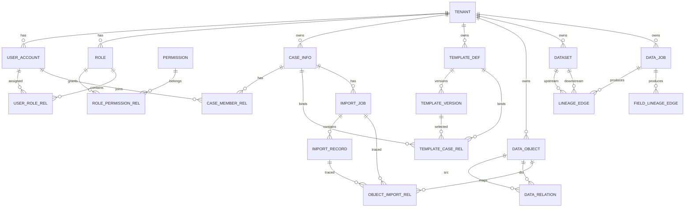

# 企业级数据平台数据库设计（Database Design）

> 范围：用户系统、案件系统、模板系统、导入记录、数据对象、数据血缘。  
> 目标：提供可直接落地的 **数据库表结构 + 字段设计 + 索引设计 + ER 图**，支持 PB 级数据平台控制面与元数据管理。

---

## 1. 设计原则

- **分层存储**：控制面（PostgreSQL/MySQL）与数据面（Lake/OLAP/Search/Graph）分离。
- **多租户隔离**：所有核心业务表均包含 `tenant_id`。
- **审计可追溯**：所有关键表统一包含 `created_at/updated_at/created_by/updated_by`。
- **软删除优先**：控制面表使用 `is_deleted`，降低误删风险。
- **幂等与可重放**：导入、任务、事件链路设计幂等键与批次号。

---

## 2. 库与 Schema 划分

建议同一实例下按 Schema 拆分：

- `iam`：用户与权限系统
- `case_mgmt`：案件系统
- `template_mgmt`：模板系统
- `ingestion`：导入记录
- `data_asset`：数据对象
- `lineage`：数据血缘

---

## 3. 数据库表结构（DDL 级设计）

> 类型以 PostgreSQL 为基准，可平移到 MySQL（`jsonb`->`json`，`bigserial`->`bigint auto_increment`）。

## 3.1 用户系统（iam）

### 3.1.1 `iam.tenant`

| 字段 | 类型 | 约束 | 说明 |
|---|---|---|---|
| id | bigint | PK | 租户ID |
| tenant_code | varchar(64) | UK, not null | 租户编码 |
| tenant_name | varchar(128) | not null | 租户名称 |
| status | smallint | not null, default 1 | 1启用 0冻结 |
| quota_json | jsonb | null | 配额配置 |
| created_at | timestamptz | not null | 创建时间 |
| updated_at | timestamptz | not null | 更新时间 |

**索引设计**
- `uk_tenant_code(tenant_code)`
- `idx_tenant_status(status)`

---

### 3.1.2 `iam.user_account`

| 字段 | 类型 | 约束 | 说明 |
|---|---|---|---|
| id | bigint | PK | 用户ID |
| tenant_id | bigint | FK -> tenant.id, not null | 所属租户 |
| username | varchar(64) | not null | 登录名 |
| email | varchar(128) | null | 邮箱 |
| phone | varchar(32) | null | 手机号 |
| password_hash | varchar(255) | not null | 密码摘要 |
| display_name | varchar(128) | null | 显示名 |
| status | smallint | not null, default 1 | 1正常 0禁用 |
| last_login_at | timestamptz | null | 最近登录时间 |
| created_at | timestamptz | not null | 创建时间 |
| updated_at | timestamptz | not null | 更新时间 |

**唯一约束**
- `(tenant_id, username)`

**索引设计**
- `idx_user_tenant_status(tenant_id, status)`
- `idx_user_email(email)`

---

### 3.1.3 `iam.role`

| 字段 | 类型 | 约束 | 说明 |
|---|---|---|---|
| id | bigint | PK | 角色ID |
| tenant_id | bigint | FK, not null | 租户ID |
| role_code | varchar(64) | not null | 角色编码 |
| role_name | varchar(128) | not null | 角色名称 |
| built_in | boolean | not null default false | 是否系统内置 |
| created_at | timestamptz | not null | 创建时间 |
| updated_at | timestamptz | not null | 更新时间 |

**唯一约束**
- `(tenant_id, role_code)`

---

### 3.1.4 `iam.permission`

| 字段 | 类型 | 约束 | 说明 |
|---|---|---|---|
| id | bigint | PK | 权限ID |
| perm_code | varchar(128) | UK, not null | 权限编码 |
| perm_name | varchar(128) | not null | 权限名称 |
| resource_type | varchar(64) | not null | 资源类型 |
| action | varchar(64) | not null | 动作 |
| created_at | timestamptz | not null | 创建时间 |

---

### 3.1.5 `iam.user_role_rel`

| 字段 | 类型 | 约束 | 说明 |
|---|---|---|---|
| id | bigint | PK | 主键 |
| tenant_id | bigint | not null | 租户ID |
| user_id | bigint | FK -> user_account.id | 用户ID |
| role_id | bigint | FK -> role.id | 角色ID |
| created_at | timestamptz | not null | 创建时间 |

**唯一约束**
- `(tenant_id, user_id, role_id)`

---

### 3.1.6 `iam.role_permission_rel`

| 字段 | 类型 | 约束 | 说明 |
|---|---|---|---|
| id | bigint | PK | 主键 |
| tenant_id | bigint | not null | 租户ID |
| role_id | bigint | FK -> role.id | 角色ID |
| permission_id | bigint | FK -> permission.id | 权限ID |
| created_at | timestamptz | not null | 创建时间 |

**唯一约束**
- `(tenant_id, role_id, permission_id)`

---

## 3.2 案件系统（case_mgmt）

### 3.2.1 `case_mgmt.case_info`

| 字段 | 类型 | 约束 | 说明 |
|---|---|---|---|
| id | bigint | PK | 案件ID |
| tenant_id | bigint | not null | 租户ID |
| case_no | varchar(64) | not null | 案件编号 |
| case_name | varchar(256) | not null | 案件名称 |
| case_type | varchar(64) | not null | 案件类型 |
| status | varchar(32) | not null | DRAFT/RUNNING/CLOSED/ARCHIVED |
| priority | smallint | default 3 | 优先级1~5 |
| owner_user_id | bigint | null | 负责人 |
| description | text | null | 描述 |
| started_at | timestamptz | null | 启动时间 |
| ended_at | timestamptz | null | 结束时间 |
| created_at | timestamptz | not null | 创建时间 |
| updated_at | timestamptz | not null | 更新时间 |
| is_deleted | boolean | not null default false | 软删除 |

**唯一约束**
- `(tenant_id, case_no)`

**索引设计**
- `idx_case_tenant_status(tenant_id, status)`
- `idx_case_owner(owner_user_id)`
- `idx_case_time(started_at, ended_at)`

---

### 3.2.2 `case_mgmt.case_member_rel`

| 字段 | 类型 | 约束 | 说明 |
|---|---|---|---|
| id | bigint | PK | 主键 |
| tenant_id | bigint | not null | 租户ID |
| case_id | bigint | FK -> case_info.id | 案件ID |
| user_id | bigint | FK -> iam.user_account.id | 用户ID |
| member_role | varchar(32) | not null | OWNER/ANALYST/VIEWER |
| created_at | timestamptz | not null | 创建时间 |

**唯一约束**
- `(tenant_id, case_id, user_id)`

---

### 3.2.3 `case_mgmt.case_tag_rel`

| 字段 | 类型 | 约束 | 说明 |
|---|---|---|---|
| id | bigint | PK | 主键 |
| tenant_id | bigint | not null | 租户ID |
| case_id | bigint | FK | 案件ID |
| tag_key | varchar(64) | not null | 标签键 |
| tag_value | varchar(128) | not null | 标签值 |
| created_at | timestamptz | not null | 创建时间 |

**索引设计**
- `idx_case_tag(tenant_id, tag_key, tag_value)`

---

## 3.3 模板系统（template_mgmt）

### 3.3.1 `template_mgmt.template_def`

| 字段 | 类型 | 约束 | 说明 |
|---|---|---|---|
| id | bigint | PK | 模板ID |
| tenant_id | bigint | not null | 租户ID |
| template_code | varchar(64) | not null | 模板编码 |
| template_name | varchar(256) | not null | 模板名称 |
| source_type | varchar(32) | not null | CSV/JSON/DB/API |
| status | varchar(32) | not null | DRAFT/PUBLISHED/DEPRECATED |
| latest_version | varchar(32) | not null | 最新版本 |
| created_by | bigint | not null | 创建人 |
| created_at | timestamptz | not null | 创建时间 |
| updated_at | timestamptz | not null | 更新时间 |
| is_deleted | boolean | not null default false | 软删除 |

**唯一约束**
- `(tenant_id, template_code)`

**索引设计**
- `idx_tpl_tenant_status(tenant_id, status)`

---

### 3.3.2 `template_mgmt.template_version`

| 字段 | 类型 | 约束 | 说明 |
|---|---|---|---|
| id | bigint | PK | 版本ID |
| tenant_id | bigint | not null | 租户ID |
| template_id | bigint | FK -> template_def.id | 模板ID |
| version_no | varchar(32) | not null | 版本号（SemVer） |
| schema_json | jsonb | not null | 字段定义 |
| mapping_json | jsonb | not null | 字段映射 |
| transform_dsl | text | null | 转换规则DSL |
| graph_mapping_json | jsonb | null | 图映射 |
| search_mapping_json | jsonb | null | 搜索映射 |
| checksum | varchar(128) | not null | 内容校验值 |
| published_at | timestamptz | null | 发布时间 |
| created_by | bigint | not null | 创建人 |
| created_at | timestamptz | not null | 创建时间 |

**唯一约束**
- `(tenant_id, template_id, version_no)`

**索引设计**
- `idx_tpl_ver_tenant_template(tenant_id, template_id)`
- `idx_tpl_ver_checksum(checksum)`

---

### 3.3.3 `template_mgmt.template_case_rel`

| 字段 | 类型 | 约束 | 说明 |
|---|---|---|---|
| id | bigint | PK | 主键 |
| tenant_id | bigint | not null | 租户ID |
| case_id | bigint | FK -> case_info.id | 案件ID |
| template_id | bigint | FK -> template_def.id | 模板ID |
| template_version_id | bigint | FK -> template_version.id | 模板版本 |
| bind_type | varchar(32) | not null | DEFAULT/MANUAL |
| created_at | timestamptz | not null | 创建时间 |

**唯一约束**
- `(tenant_id, case_id, template_id, template_version_id)`

---

## 3.4 导入记录（ingestion）

### 3.4.1 `ingestion.import_job`

| 字段 | 类型 | 约束 | 说明 |
|---|---|---|---|
| id | bigint | PK | 导入任务ID |
| tenant_id | bigint | not null | 租户ID |
| case_id | bigint | FK -> case_info.id | 案件ID |
| template_version_id | bigint | FK | 模板版本ID |
| source_type | varchar(32) | not null | FILE/API/DB/MQ |
| source_uri | text | null | 来源地址 |
| batch_no | varchar(64) | not null | 批次号 |
| idempotency_key | varchar(128) | not null | 幂等键 |
| status | varchar(32) | not null | PENDING/RUNNING/SUCCESS/FAILED/CANCELED |
| total_count | bigint | default 0 | 总记录数 |
| success_count | bigint | default 0 | 成功数 |
| failed_count | bigint | default 0 | 失败数 |
| started_at | timestamptz | null | 开始时间 |
| ended_at | timestamptz | null | 结束时间 |
| error_message | text | null | 错误摘要 |
| created_by | bigint | not null | 创建人 |
| created_at | timestamptz | not null | 创建时间 |
| updated_at | timestamptz | not null | 更新时间 |

**唯一约束**
- `(tenant_id, idempotency_key)`

**索引设计**
- `idx_import_tenant_case(tenant_id, case_id)`
- `idx_import_status(status)`
- `idx_import_batch(tenant_id, batch_no)`
- `idx_import_time(started_at)`

---

### 3.4.2 `ingestion.import_record`

| 字段 | 类型 | 约束 | 说明 |
|---|---|---|---|
| id | bigint | PK | 记录ID |
| tenant_id | bigint | not null | 租户ID |
| import_job_id | bigint | FK -> import_job.id | 导入任务ID |
| source_row_no | bigint | null | 源行号 |
| raw_payload | jsonb | not null | 原始数据 |
| normalized_payload | jsonb | null | 标准化数据 |
| process_status | varchar(32) | not null | SUCCESS/FAILED |
| error_code | varchar(64) | null | 错误码 |
| error_message | text | null | 错误信息 |
| created_at | timestamptz | not null | 创建时间 |

**索引设计**
- `idx_imp_rec_job(import_job_id)`
- `idx_imp_rec_status(tenant_id, process_status)`
- `idx_imp_rec_raw_gin USING gin(raw_payload)`

---

## 3.5 数据对象（data_asset）

### 3.5.1 `data_asset.data_object`

| 字段 | 类型 | 约束 | 说明 |
|---|---|---|---|
| id | bigint | PK | 数据对象ID |
| tenant_id | bigint | not null | 租户ID |
| object_uid | varchar(128) | not null | 全局对象UID |
| object_type | varchar(64) | not null | PERSON/ORG/DEVICE/ACCOUNT/EVENT/DOC |
| object_name | varchar(256) | null | 对象名称 |
| object_key | varchar(256) | null | 业务主键（可多源归并） |
| attrs_json | jsonb | null | 属性集合 |
| source_system | varchar(64) | null | 来源系统 |
| confidence_score | numeric(5,2) | null | 置信度 |
| first_seen_at | timestamptz | null | 首次出现 |
| last_seen_at | timestamptz | null | 最近出现 |
| created_at | timestamptz | not null | 创建时间 |
| updated_at | timestamptz | not null | 更新时间 |

**唯一约束**
- `(tenant_id, object_uid)`

**索引设计**
- `idx_obj_tenant_type(tenant_id, object_type)`
- `idx_obj_key(tenant_id, object_key)`
- `idx_obj_attrs_gin USING gin(attrs_json)`
- `idx_obj_last_seen(last_seen_at)`

---

### 3.5.2 `data_asset.data_relation`

| 字段 | 类型 | 约束 | 说明 |
|---|---|---|---|
| id | bigint | PK | 关系ID |
| tenant_id | bigint | not null | 租户ID |
| relation_uid | varchar(128) | not null | 关系UID |
| src_object_id | bigint | FK -> data_object.id | 源对象 |
| dst_object_id | bigint | FK -> data_object.id | 目标对象 |
| relation_type | varchar(64) | not null | OWN/CONTACT/TRANSFER/ACCESS/... |
| relation_attrs_json | jsonb | null | 关系属性 |
| weight | numeric(8,4) | default 1 | 权重 |
| event_time | timestamptz | null | 关系发生时间 |
| created_at | timestamptz | not null | 创建时间 |

**唯一约束**
- `(tenant_id, relation_uid)`

**索引设计**
- `idx_rel_src(tenant_id, src_object_id, relation_type)`
- `idx_rel_dst(tenant_id, dst_object_id, relation_type)`
- `idx_rel_time(event_time)`
- `idx_rel_attrs_gin USING gin(relation_attrs_json)`

---

### 3.5.3 `data_asset.object_import_rel`

| 字段 | 类型 | 约束 | 说明 |
|---|---|---|---|
| id | bigint | PK | 主键 |
| tenant_id | bigint | not null | 租户ID |
| object_id | bigint | FK -> data_object.id | 对象ID |
| import_job_id | bigint | FK -> ingestion.import_job.id | 导入任务 |
| import_record_id | bigint | FK -> ingestion.import_record.id | 导入记录 |
| created_at | timestamptz | not null | 创建时间 |

**唯一约束**
- `(tenant_id, object_id, import_record_id)`

---

## 3.6 数据血缘（lineage）

### 3.6.1 `lineage.dataset`

| 字段 | 类型 | 约束 | 说明 |
|---|---|---|---|
| id | bigint | PK | 数据集ID |
| tenant_id | bigint | not null | 租户ID |
| dataset_code | varchar(128) | not null | 数据集编码 |
| dataset_name | varchar(256) | not null | 数据集名称 |
| layer | varchar(16) | not null | ODS/DWD/DWS/ADS |
| storage_type | varchar(32) | not null | ICEBERG/CH/ES/GRAPH |
| physical_location | text | null | 物理位置 |
| schema_json | jsonb | null | Schema |
| owner_user_id | bigint | null | Owner |
| created_at | timestamptz | not null | 创建时间 |
| updated_at | timestamptz | not null | 更新时间 |

**唯一约束**
- `(tenant_id, dataset_code)`

**索引设计**
- `idx_ds_layer(tenant_id, layer)`
- `idx_ds_storage(tenant_id, storage_type)`

---

### 3.6.2 `lineage.data_job`

| 字段 | 类型 | 约束 | 说明 |
|---|---|---|---|
| id | bigint | PK | 作业ID |
| tenant_id | bigint | not null | 租户ID |
| job_code | varchar(128) | not null | 作业编码 |
| job_name | varchar(256) | not null | 作业名称 |
| job_type | varchar(32) | not null | STREAM/BATCH/SQL |
| engine_type | varchar(32) | not null | FLINK/SPARK/TRINO |
| schedule_expr | varchar(128) | null | 调度表达式 |
| owner_user_id | bigint | null | Owner |
| created_at | timestamptz | not null | 创建时间 |
| updated_at | timestamptz | not null | 更新时间 |

**唯一约束**
- `(tenant_id, job_code)`

**索引设计**
- `idx_job_type(tenant_id, job_type)`
- `idx_job_engine(tenant_id, engine_type)`

---

### 3.6.3 `lineage.lineage_edge`

| 字段 | 类型 | 约束 | 说明 |
|---|---|---|---|
| id | bigint | PK | 主键 |
| tenant_id | bigint | not null | 租户ID |
| src_dataset_id | bigint | FK -> dataset.id | 上游数据集 |
| dst_dataset_id | bigint | FK -> dataset.id | 下游数据集 |
| job_id | bigint | FK -> data_job.id | 产生该边的作业 |
| transform_desc | text | null | 转换说明/SQL摘要 |
| version_tag | varchar(64) | null | 版本标记 |
| effective_at | timestamptz | not null | 生效时间 |
| expired_at | timestamptz | null | 失效时间 |
| created_at | timestamptz | not null | 创建时间 |

**索引设计**
- `idx_lin_src(tenant_id, src_dataset_id)`
- `idx_lin_dst(tenant_id, dst_dataset_id)`
- `idx_lin_job(tenant_id, job_id)`
- `idx_lin_time(effective_at, expired_at)`

---

### 3.6.4 `lineage.field_lineage_edge`

| 字段 | 类型 | 约束 | 说明 |
|---|---|---|---|
| id | bigint | PK | 主键 |
| tenant_id | bigint | not null | 租户ID |
| src_dataset_id | bigint | not null | 上游数据集 |
| src_field_name | varchar(128) | not null | 上游字段 |
| dst_dataset_id | bigint | not null | 下游数据集 |
| dst_field_name | varchar(128) | not null | 下游字段 |
| job_id | bigint | null | 作业ID |
| transform_expr | text | null | 字段表达式 |
| confidence_score | numeric(5,2) | null | 解析置信度 |
| created_at | timestamptz | not null | 创建时间 |

**索引设计**
- `idx_flin_src(tenant_id, src_dataset_id, src_field_name)`
- `idx_flin_dst(tenant_id, dst_dataset_id, dst_field_name)`
- `idx_flin_job(tenant_id, job_id)`

---

## 4. ER 图（Mermaid）



---

## 5. 字段设计规范（统一约定）

### 5.1 通用字段

- 主键：`id bigint`
- 租户：`tenant_id bigint`
- 审计：`created_at`, `updated_at`, `created_by`, `updated_by`
- 软删：`is_deleted boolean`
- 版本：`version int`（乐观锁可选）

### 5.2 状态字段建议

- 枚举值统一大写英文（如 `RUNNING`, `FAILED`）
- 业务状态与系统状态分离（如 `status` + `process_status`）

### 5.3 JSON 字段建议

- `jsonb` 用于半结构化扩展字段
- 高频过滤键冗余为单独列，避免全靠 JSON 路径扫描

---

## 6. 索引设计总则

### 6.1 控制面高频查询索引

- 所有列表查询必须包含：`tenant_id + status + created_at`
- 外键列默认建 B-Tree 索引
- 唯一幂等键建唯一索引（如 `idempotency_key`）

### 6.2 JSON/全文场景索引

- `jsonb` 字段使用 GIN 索引
- 全文检索场景不放在关系库，写入 OpenSearch/ES

### 6.3 血缘图查询索引

- `lineage_edge` 对 `src_dataset_id/dst_dataset_id/job_id` 建组合索引
- 字段血缘按 `(dataset, field)` 建联合索引提升影响分析效率

### 6.4 分区与归档建议

- `import_record`, `lineage_edge`, `field_lineage_edge` 建议按月分区
- 历史归档到对象存储，主库保留近 6~12 个月热数据

---

## 7. 推荐部署与容量建议

- **OLTP 数据库**：PostgreSQL 主从 + 读写分离 + 自动故障切换
- **高可用**：至少 3 节点（生产）
- **连接池**：PgBouncer
- **备份策略**：全量（天）+ 增量/WAL（小时级）
- **RPO/RTO**：RPO < 15 min，RTO < 1 h

---

## 8. 可选 DDL 示例（节选）

```sql
create table ingestion.import_job (
  id bigserial primary key,
  tenant_id bigint not null,
  case_id bigint not null,
  template_version_id bigint,
  source_type varchar(32) not null,
  source_uri text,
  batch_no varchar(64) not null,
  idempotency_key varchar(128) not null,
  status varchar(32) not null,
  total_count bigint default 0,
  success_count bigint default 0,
  failed_count bigint default 0,
  started_at timestamptz,
  ended_at timestamptz,
  error_message text,
  created_by bigint not null,
  created_at timestamptz not null default now(),
  updated_at timestamptz not null default now(),
  constraint uk_import_idempotency unique (tenant_id, idempotency_key)
);
create index idx_import_tenant_case on ingestion.import_job(tenant_id, case_id);
create index idx_import_status on ingestion.import_job(status);
```

---

## 9. 交付物小结

本设计已覆盖：

1. 用户系统表结构
2. 案件系统表结构
3. 模板系统表结构
4. 导入记录表结构
5. 数据对象表结构
6. 数据血缘表结构
7. ER 图
8. 字段设计规范
9. 索引设计规范

保存文件：`database.md`
